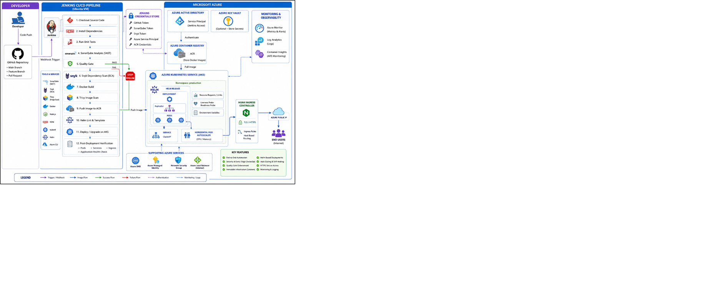

# DevSecOps Pipeline for Node.js Application Deployment to AKS

An end-to-end automated DevSecOps and CI/CD pipeline demonstrating secure cloud infrastructure provisioning, container vulnerability scanning, static code analysis, and automated Kubernetes deployment.

---

## 🏗️ Architecture & Tech Stack

* **Cloud Provider:** Microsoft Azure (Azure Kubernetes Service - AKS)
* **Infrastructure as Code:** Terraform
* **Containerization:** Docker (Alpine-based Node.js runtime)
* **CI/CD Orchestration:** Jenkins
* **Security & Compliance Scanning:** Snyk (Dependencies/Code) & Trivy (Container Images)
* **Package Management & Deployment:** Helm
* **Ingress & Traffic Management:** NGINX Ingress Controller with TLS termination

---

## 🚀 Pipeline Workflow

```
[ Git Push ] 
     │
     ▼
[ Jenkins CI/CD Pipeline ]
     ├── 1. Infrastructure Provisioning (Terraform -> Azure AKS)
     ├── 2. Source Code & Dependency Scanning (Snyk)
     ├── 3. Docker Image Build & Container Vulnerability Scan (Trivy)
     ├── 4. Push Secure Artifact to Container Registry
     └── 5. Helm Chart Deployment to AKS Cluster (with NGINX Ingress)
```

---

## 📂 Project Structure

```text
├── terraform/                # Infrastructure provisioning configuration
│   ├── main.tf
│   ├── variables.tf
│   └── outputs.tf
├── k8s/                      # Kubernetes manifests and Helm charts
│   ├── templates/
│   ├── Chart.yaml
│   └── values.yaml
├── src/                      # Node.js application source code
│   ├── server.js
│   ├── package.json
│   └── Dockerfile
├── Jenkinsfile               # Automated CI/CD pipeline definition
└── README.md
```

---

## ⚙️ Key Features & DevSecOps Practices

* **Infrastructure as Code (IaC):** Modular Terraform configuration managing Azure resource groups, virtual networks, and AKS clusters.
* **Shift-Left Security:** Automated dependency checks via Snyk and deep filesystem/image scanning via Trivy integrated directly into the CI/CD stages to block critical vulnerabilities prior to deployment.
* **Declarative Deployments:** Application packaging and release management handled cleanly through Helm charts with enforced resource limits and requests.
* **Secure Ingress Routing:** Exposing services externally via NGINX Ingress with secure HTTP/HTTPS configurations.

---

## 🛠️ Getting Started & Prerequisites

### Prerequisites
* Azure CLI configured with appropriate subscription permissions
* Terraform (v1.5+)
* Jenkins server with Docker, kubectl, Helm, and Snyk CLI plugins installed
* Access to an Azure Container Registry (ACR) or Docker Hub repository

### Deployment Steps
1. **Clone the repository:**
   ```bash
   git clone https://github.com/your-username/devsecops-nodejs-aks.git
   cd devsecops-nodejs-aks
   ```
2. **Provision Infrastructure:**
   ```bash
   cd terraform
   terraform init
   terraform plan
   terraform apply
   ```
3. **Configure Jenkins Credentials:**
   Add your Azure credentials, Snyk API token, and container registry secrets securely to the Jenkins Credential Store.
4. **Trigger Pipeline:**
   Commit changes or trigger the `Jenkinsfile` job manually to execute the complete build, scan, and deploy workflow.

---

## 📄 License
This project is licensed under the MIT License.
